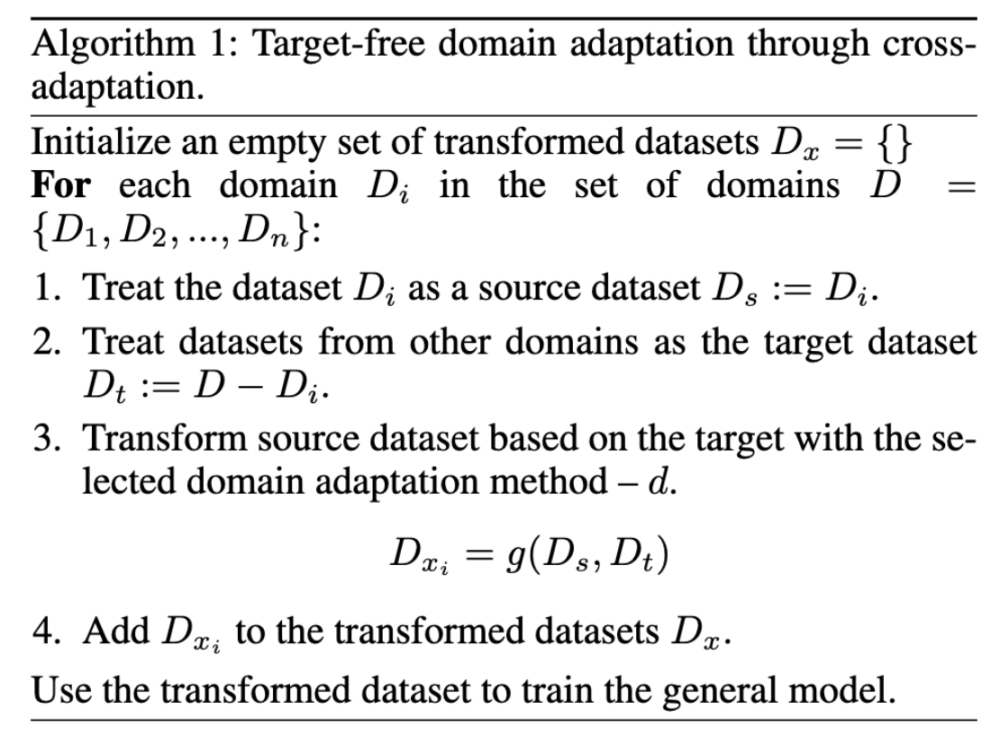

# Cross-Adaptation

[](https://www.python.org/downloads/)
[](LICENSE)

A Python library for multi-target domain adaptation that enables robust machine learning models across different domains.

## 📖 Overview

Cross-adaptation performs domain adaptation across multiple training datasets {D₁, D₂, ..., Dₙ} by iteratively changing which dataset serves as the source and which as targets. This multi-target domain adaptation approach:

- **Transforms datasets** through iterative source-target switching
- **Works with any domain adaptation method** as the underlying algorithm g
- **Improves generalization** to new, unseen domains
- **Concatenates transformed datasets** D_x = {D_x1, D_x2, ..., D_xn} for final model training

The resulting model f can successfully predict on domains not present during training.

## 🔬 Algorithm



## 🚀 Quick Start

### Prerequisites

- Python ≥ 3.12
- [uv](https://docs.astral.sh/uv/) (recommended) or [Poetry](https://python-poetry.org/docs/)

### Installation

```bash
# Using uv (recommended)
uv sync

# Or using Poetry
poetry install
```

### Basic Usage
```python
import pandas as pd
from adapt.instance_based import KMM
from sklearn.tree import DecisionTreeClassifier
from cross_adaptation import Adapter

# Prepare your datasets (each DataFrame should have a 'target' column)
data = {
    "dataset1": pd.DataFrame(...),  # Your first domain dataset
    "dataset2": pd.DataFrame(...)   # Your second domain dataset
}

# Choose your domain adaptation method
adapt_model = KMM(kernel="rbf", gamma=1.0)

# Select your classifier
classifier = DecisionTreeClassifier(random_state=42)

# Create and run the adapter
adapter = Adapter(
    data=data,
    adapt_model=adapt_model,
    classifier=classifier
)

# Get the adapted dataset
adapted_dataset = adapter.adapt()
```

## 🧪 Running Experiments

### Configuration

Adjust experiment settings in `experiments/config/`:
- Modify dataset parameters
- Choose domain adaptation methods
- Set classifier options

### Execution

```bash
# Using uv
uv run experiments/main.py

# Using Poetry
poetry run experiments/main.py

# Or using the provided script
./run_experiments.sh
```

## 📊 Key Features

- **Multiple Domain Support**: Handle any number of source/target domain combinations
- **Method Agnostic**: Compatible with various domain adaptation algorithms from the `adapt` library
- **Sklearn Integration**: Seamless integration with scikit-learn classifiers
- **Experimental Framework**: Built-in experiment management with Hydra configuration
- **Visualization Tools**: Analysis and visualization utilities for adaptation results

## 🛠️ Dependencies

Key libraries used:
- `adapt`: Domain adaptation algorithms
- `scikit-learn`: Machine learning utilities
- `pandas`: Data manipulation
- `transformers`: For advanced ML models
- `wandb`: Experiment tracking
- `hydra-core`: Configuration management

## 📁 Project Structure

```
cross-adaptation/
├── src/
│   ├── cross_adaptation/       # Main library code
│   └── visualization/          # Visualization utilities
├── experiments/               # Experimental framework
├── docs/                     # Documentation and assets
└── main.py                  # Main execution script
```

## 🤝 Contributing

Contributions are welcome! Please feel free to submit issues and enhancement requests.

## 📄 License

This project is licensed under the MIT License - see the [LICENSE](LICENSE) file for details.

## 🔬 Research

If you use this library in your research, please consider citing our work.

## 📞 Support

For questions and support, please open an issue on the GitHub repository.
